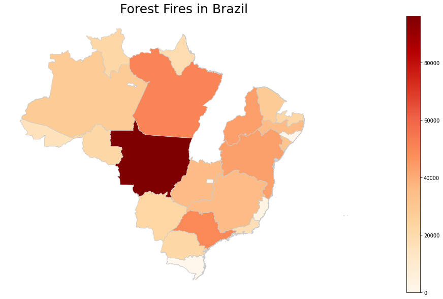

# Forest Fires In Brazil

This Python project is dedicated to visualizing and analyzing different forest fires that have occurred in Brazil. By leveraging data visualization techniques, we aim to provide insights into the spatial distribution, temporal trends, and causes of these fires. Additionally, the project includes a heatmap generated using Geopandas to illustrate the intensity and geographical spread of forest fires in Brazil.

## Overview

Brazil's vast forests are vital for the planet's health, but they face threats from forest fires. This project is dedicated to analyzing and visualizing forest fires in Brazil to better understand their impact, patterns, and causes. By doing so, we aim to contribute to efforts to protect and conserve these critical ecosystems.

## Methodology

1. Data Collection: Gather and preprocess the forest fire data and geospatial data, ensuring data consistency and integrity.

2. Data Visualization: Utilize data visualization libraries such as Matplotlib and Seaborn to create informative plots, charts to depict forest fire trends.

3. Geopandas Heatmap: Use Geopandas to generate a heatmap that visualizes the spatial distribution and intensity of forest fires across different regions of Brazil.

## Results

The project's results include a collection of informative visualizations, including a geospatial heatmap. These visualizations aim to provide insights into the patterns and causes of forest fires in Brazil, helping raise awareness and inform conservation efforts.

The GeoPandas plot is as per - 

<kbd>

</kbd>

